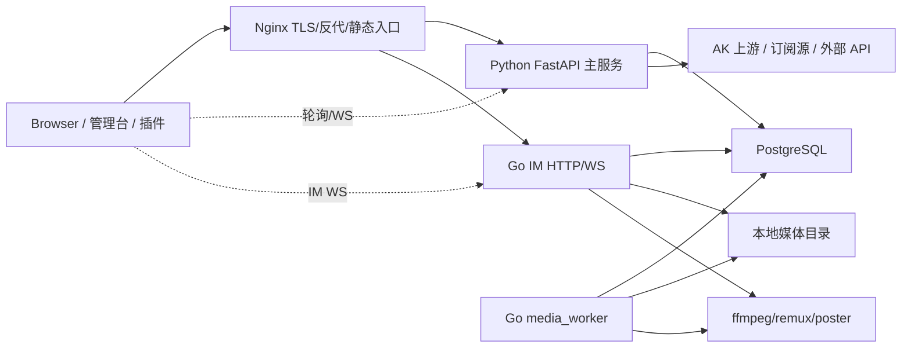
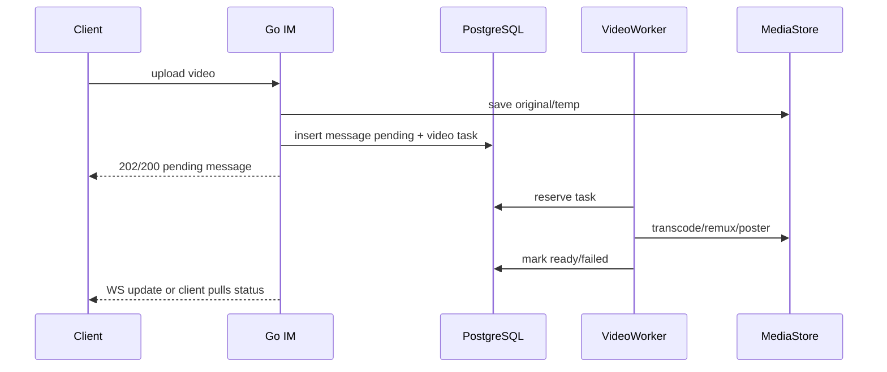

# AK Proxy 性能优化专项蓝图

日期：2026-06-07
范围：Python/FastAPI 主服务、PostgreSQL 访问层、Go IM 与媒体处理、管理前端、Nginx/部署容量。
状态：分析与设计文档，尚未修改业务代码。

## 1. 结论

这套系统当前的性能瓶颈不是单个慢函数，而是多个共享资源耦合在一起：FastAPI 主服务同时承担 API、静态资源、WebSocket、插件资产和外部代理逻辑；PostgreSQL 连接池会在压力下自动扩容并被大量直接 `pool.acquire()` 绕过治理；Go IM 的视频和媒体处理会把 CPU/磁盘重活放进请求路径或近请求路径；管理前端存在大量分散轮询和整块 DOM 重绘。

最值得优先处理的方向不是简单加机器，而是先建立资源边界：

1. 给事件循环、DB 连接池、媒体 CPU、前端轮询建立预算和可观测指标。
2. 把同步 I/O、ffmpeg、全表聚合、整页刷新从核心请求路径移走。
3. 把 `COUNT(*) + OFFSET + ILIKE '%x%'`、`MAX(seq_no)+1`、JSONB 热字段过滤改成可索引、可增量、可限流的读模型。
4. 把前端“每个面板自己开定时器”改成统一轮询注册表和可取消请求。
5. 把 Nginx/静态资源/缓存/压缩职责从 Python 主服务里尽量剥离出去。

如果先按这些边界治理，再考虑 worker 数量、连接池大小和机器规格，收益会更稳定，也不会把当前隐患放大。

## 2. 覆盖与证据

本次性能专项基于本地源码扫描、结构化模式统计、关键路径人工阅读，以及 DB/Go IM 专项探索结果汇总。未连接生产数据库，未执行压测，因此本文给出的是整改设计与验证门禁，不声称已经测得生产瓶颈的真实占比。

关键规模信号：

| 文件 | 行数 | 性能含义 |
| --- | ---: | --- |
| `public_admin/server/proxy_server.py` | 9641 | 主服务职责高度集中，包含大量 API、静态资产、代理和运行时代码 |
| `public_admin/server/database_pg.py` | 3386 | DB 初始化、连接池、登录记录、后台列表和通知等访问逻辑集中 |
| `public_admin/server/outbound_dispatcher.py` | 1032 | 有较好的长生命周期 HTTP client 池模式，可作为后续统一 client 注册表参考 |
| `public_admin/frontend/pages/admin.html` | 14644 | 管理台单文件过大，轮询、渲染和业务逻辑混杂 |
| `public_admin/frontend/host/chat_widget.js` | 4538 | 客户端运行时较重，含心跳与 PWA 检查 |
| `public_admin/frontend/host/runtime/ak_client_runtime.js` | 3767 | host runtime 承载心跳、远程协助与补丁逻辑 |
| `public_admin/plugins/im/user/im_client.js` | 6506 | IM 客户端单体逻辑较重 |
| `im_server/internal/app/app.go` | 2470 | IM HTTP/WS、消息写入、广播、会话列表核心路径集中 |
| `im_server/internal/app/video_messages.go` | 434 | 视频上传请求路径内处理 ffmpeg/remux/poster |
| `im_server/internal/media/worker.go` | 506 | 媒体 worker 已存在，但并发与任务模型没有完全发挥作用 |

静态热点计数：

| 模式 | 次数 | 解读 |
| --- | ---: | --- |
| `pool.acquire(` | 218 | DB 获取连接分散，难以统一限流、超时、指标和扩容策略 |
| `setInterval(` | 51 | 前端轮询分散，容易产生重复请求、后台标签页浪费和清理遗漏 |
| `setTimeout(` | 153 | 包含防抖/补丁/轮询退避，需注册化管理 |
| `innerHTML =` | 319 | 大量整块重绘，列表和聊天记录在数据增长时容易触发长任务 |
| `querySelectorAll(` | 131 | DOM 扫描较多，需关注频繁路径 |
| `httpx.AsyncClient(` | 15 | 多处临时 client 创建和 TLS 策略分散 |
| `asyncio.create_task(` | 20 | 后台任务需要统一生命周期、异常和退出管理 |
| `new WebSocket(` | 12 | 多入口 WS，需要心跳、重连、退避和连接预算统一 |
| `exec.Command` | 6 | Go 侧存在外部进程调用，ffmpeg 是最高成本项 |
| `time.NewTicker` | 3 | Go 后台循环较少，但媒体 worker 调度方式需调整 |

DB 查询模式扫描：

| 模式 | 次数 | 典型位置 |
| --- | ---: | --- |
| OFFSET 分页 | 10 | `database_pg.py:1829`、`:1981`、`:2443`、`:3140`、`:3488`，license center repository |
| ILIKE 搜索 | 44 | `database_pg.py:2862`、`:2928`、`:2962`，recommend tree、risk isolation、admin lists |
| COUNT(*) | 49 | `database_pg.py:1848`、`:2063`、`:2868`、`:2933`、dashboard/monitoring/license |
| 重聚合查询 | 4 | `performance/dashboard_stats/repository.py:57-59`、`:75` |

事件循环阻塞证据：

| 位置 | 现象 | 风险 |
| --- | --- | --- |
| `public_admin/server/proxy_server.py:3004` | async 路由内直接调用 `fetch_subscription(url)` | 订阅源慢或不可达时阻塞事件循环 |
| `public_admin/server/proxy_server.py:3104` | async 路由内直接调用 `fetch_subscription(url)` | 一键应用订阅可能拖住主服务 |
| `public_admin/server/sub_parser.py:590` | 使用同步 `urllib` 拉取订阅 | 默认 15 秒超时，且目前 TLS 校验策略也需要安全侧整改 |
| `proxy_server.py:11577-12023` | 多个 async 静态资源路由内 `open(...).read()` | 资源请求在事件循环线程做磁盘 I/O |

Go IM 证据：

| 位置 | 现象 | 风险 |
| --- | --- | --- |
| `im_server/internal/app/video_messages.go:357` | 上传请求内调用 `persistVideoAsset` | ffmpeg/remux/poster 阻塞用户请求 |
| `im_server/internal/app/video_messages.go:217` | `ffmpeg` 最长 20 分钟 | CPU 与磁盘重活不应占请求路径 |
| `im_server/internal/app/app.go:2037` | `SELECT MAX(seq_no)+1` | 高并发同会话发送时锁竞争/唯一冲突风险 |
| `im_server/internal/app/app.go:1537-1552` | 会话列表多处相关子查询 | 会话和消息增长后每次列表查询成本上升 |
| `im_server/internal/app/app.go:395` | `http.Server` 无显式超时 | 慢连接和异常客户端会占资源 |
| `im_server/internal/media/worker.go:173-190` | 每轮只取 1 个 slot/任务 | 配置的 batch/concurrency 没有有效转化为吞吐 |
| `im_server/internal/media/worker.go:275` | 每个任务后 `debug.FreeOSMemory()` | 频繁强制 GC/归还内存可能造成吞吐抖动 |

前端证据：

| 位置 | 现象 | 风险 |
| --- | --- | --- |
| `public_admin/frontend/pages/admin.html:6965` | 在线用户数全局轮询 | 多 tab/多管理员时请求放大 |
| `admin.html:6980` | 在线用户列表轮询 | 与全局轮询叠加 |
| `admin.html:7072` | 聊天历史每次清空重绘 | 历史增长后产生长任务和滚动抖动 |
| `admin.html:7104`、`:10767` | 聊天历史 3 秒轮询作为 WS 备份 | WS 正常时仍可能产生重复请求 |
| `admin.html:9684` | dashboard 30 秒轮询 | 后端 dashboard 聚合会被周期性触发 |
| `admin.html:9835`、`:9847` | 设置页 8 秒刷新多个面板 | 设置页停留会形成持续后台压力 |
| `admin.html:10698`、`:10703` | 全局 stats/token verify 轮询 | 所有登录管理员都会触发 |
| `admin.html:12877` | 远程协助心跳 8 秒 | 需要统一连接与心跳预算 |

## 3. 性能架构图



性能治理要让这张图里的每条边都有预算：浏览器轮询预算、Nginx 连接预算、FastAPI 事件循环预算、DB 连接预算、Go IM 请求预算、媒体 CPU 预算、外部 API 超时预算。

## 4. 优先级模型

排序按四个维度打分：用户可见延迟、资源放大倍数、故障影响面、整改风险。`P0` 表示不建议等到功能开发之后再做；`P1` 表示应随核心整改一起推进；`P2` 表示中期工程化收益。

| 优先级 | 优化点 | 主要收益 | 风险/前置 |
| --- | --- | --- | --- |
| P0 | 固定 DB 连接预算，移除运行时自动扩容 | 防止高峰时把 PostgreSQL 打满，提升故障可控性 | 需要补齐 acquire wait 指标和超时 |
| P0 | 登录写路径拆分为事件写入 + 异步聚合 | 降低登录峰值写放大，保护登录链路 | 需要确保审计记录不丢 |
| P0 | async 路由内同步 I/O 下沉到 bounded executor 或改 async client | 防止订阅源/磁盘拖死事件循环 | 需要统一超时、取消和 SSRF/TLS 策略 |
| P0 | 视频上传/首访转码改异步任务 | 上传 API p95 从“上传+转码”降为“上传+入队” | 需要任务表、状态回写和前端 pending 状态 |
| P0 | dashboard/admin list 从实时全表聚合改 rollup/read model | 降低周期轮询对 DB 的持续压力 | 需要增量统计一致性设计 |
| P0 | 前端轮询统一注册和请求去重 | 减少后台 tab、多面板、多管理员请求放大 | 需要梳理 panel lifecycle |
| P1 | IM 消息序号改原子 sequencer | 降低同会话高并发发送冲突 | 需要迁移现有会话序号 |
| P1 | 会话列表 unread/mention 改读模型 | 降低会话列表随消息数增长的成本 | 需要读模型回填与一致性校验 |
| P1 | 媒体 worker 改 bounded worker pool | 让并发配置变成真实吞吐，同时受 CPU/内存保护 | 需要避免同任务重复处理 |
| P1 | HTTP client registry | 降低连接建立成本，统一 TLS/timeout/metrics | 要和安全整改中的 TLS 校验策略合并 |
| P1 | Nginx 静态资源缓存、压缩、超时分层 | 降低 Python 静态文件负担和首屏成本 | 需要区分 SW/manifest 与 hashed assets |
| P2 | 管理台模块拆分和懒加载 | 降低首屏 JS 解析/执行成本 | 需要构建或 manifest 机制 |
| P2 | 大列表虚拟滚动和 DOM diff | 降低长任务和重排 | 需要逐面板替换 |
| P2 | COPY/staging bulk writer | 提升点数历史、通知投递等批量写吞吐 | 需要失败恢复和幂等键 |

## 5. Python/FastAPI 优化设计

### 5.1 事件循环阻塞治理

现状：

`/api/dispatcher/parse_sub` 和 `/api/dispatcher/apply_sub` 是 async 路由，但会同步调用 `fetch_subscription(url)`。`fetch_subscription` 底层使用同步网络 I/O。多个静态资源路由也在 async handler 内直接读磁盘。

设计：

新增独立模块，避免把实现散在 `proxy_server.py` 内：

| 模块 | 职责 |
| --- | --- |
| `public_admin/server/runtime_io/async_bridge.py` | 提供 `run_blocking_io(name, func, timeout, budget_key)`，内部使用 bounded executor、超时、取消、指标 |
| `public_admin/server/http_clients/registry.py` | 管理长生命周期 `httpx.AsyncClient`，按用途区分 admin/internal/upstream/proxy，统一 limits、timeout、TLS 策略 |
| `public_admin/server/static_assets/manifest.py` | 建立静态资产 allow-list、ETag、Last-Modified、启动预读或 Nginx offload 策略 |
| `public_admin/server/tasks/supervisor.py` | 统一 `create_task` 生命周期、异常日志、优雅退出、队列深度 |
| `public_admin/server/runtime_performance/event_loop_probe.py` | 采集 event loop lag、慢 handler、executor 队列长度 |

约束：

1. 订阅源拉取需要与安全整改合并：协议白名单、DNS/IP 私网阻断、TLS 校验、最大响应体、最大跳转次数。
2. bounded executor 只能作为过渡方案；长期应优先把网络 I/O 改成 async client。
3. 静态资源优先由 Nginx 直接服务；必须由 Python 动态生成的资源才保留 handler。

验收：

| 指标 | 目标 |
| --- | --- |
| event loop lag p99 | 常态小于 100ms，压测小于 250ms |
| executor queue depth | 有上限，有拒绝/降级日志 |
| 订阅解析超时 | 不超过配置值，超时不影响其他 API |
| 静态资源命中 | 可用 ETag/304 或 Nginx 静态命中 |

### 5.2 HTTP client 复用

现状：

仓库内有多处 `async with httpx.AsyncClient(...)`。`outbound_dispatcher.py` 和 `BrowseHttpClientPool` 已经有较好的 pooled client 思路，但模式没有统一到全系统。

设计：

建立 `HttpClientRegistry`：

| client 类型 | 建议用途 | 连接策略 |
| --- | --- | --- |
| `internal` | 调用本机/内部服务 | 短 connect timeout，严格域名/IP allow-list |
| `upstream` | AK 上游业务请求 | keepalive，按 host 限速，显式 TLS 校验 |
| `subscription` | 订阅源拉取 | 低并发、响应体大小上限、禁止私网地址 |
| `probe` | 健康检查/监控 | 极短 timeout，不跟业务 client 共享池 |
| `proxy-browse` | 需要代理的浏览会话 | 沿用按 proxy URL 分池，但补 metrics 和关闭钩子 |

不要把所有出站流量塞进一个全局 client。不同用途要有不同超时、连接池、TLS 策略和错误预算。

### 5.3 静态资产服务

现状：

`proxy_server.py` 中大量 `/admin/api/*.js`、PWA、icon、panel asset handler 直接读本地文件，并且多数返回 `no-cache`。这会让 Python 主服务承担本该由 Nginx/浏览器缓存承担的工作。

设计：

1. 构建 `StaticAssetManifest`：启动时扫描 allow-list，记录 path、mtime、size、hash、media_type。
2. 对稳定资源使用 `Cache-Control: public, max-age=31536000, immutable`，文件名含 hash。
3. 对 SW/manifest 保留 `no-store` 或短缓存，因为它们影响 PWA 更新语义。
4. Nginx 增加 `try_files` 静态路径，Python 只处理鉴权后动态资源。
5. 对必须鉴权的 JS/CSS，使用 ETag 和 304，避免每次读文件和传输完整内容。

### 5.4 worker 数量不能盲目上调

`public_admin/server/runtime_performance/worker_policy.py` 目前 `AK_PROXY_WORKERS` 默认 1，多 worker 只有环境变量打开。不能把“开多 worker”当作第一优化，因为主服务内可能存在内存状态、任务、缓存和 WS 连接状态。正确顺序是：

1. 先梳理哪些状态必须外部化：session、presence、任务队列、缓存失效、WS fanout。
2. 建立 DB 连接预算公式：`Python workers * Python pool max + Go IM pool + media worker pool + 运维脚本 <= PostgreSQL max_connections * 0.7`。
3. 对每个 worker 建 readiness/liveness，确保单 worker 卡顿可被摘除。
4. 最后再逐步打开 2/4 worker 并观察 DB acquire wait、event loop lag、错误率。

## 6. PostgreSQL 优化设计

### 6.1 连接池治理

现状：

`database_pg.py:115-156` 在池耗尽时会自动扩容并替换全局 `_pool`，上限到 100，还把扩容结果写入本地状态文件。与此同时，代码中存在大量直接 `pool.acquire()`，`safe_acquire()` 没有形成统一入口。

风险：

1. 压力越大连接越多，可能把数据库从慢变成不可用。
2. 替换全局 pool 会给正在运行的协程和事务带来不可预测抖动。
3. 缺少 acquire wait 指标时，扩容掩盖了真正的慢 SQL 或请求风暴。

设计：

| 模块 | 职责 |
| --- | --- |
| `public_admin/server/db/session.py` | 统一 `acquire_db(budget, timeout)`，记录等待时间、超时、调用点 |
| `public_admin/server/db/budget.py` | 定义登录、后台列表、监控、通知、批量任务等连接预算 |
| `public_admin/server/db/statement_timeout.py` | 按查询类型设置 `SET LOCAL statement_timeout` |
| `public_admin/server/db/metrics.py` | 暴露 pool size、idle、waiting、acquire p95/p99、timeout count |

策略：

1. 固定最大连接池，不在运行时扩容。
2. 压力过高时优先拒绝低优先级请求，例如 dashboard force refresh、后台大列表、监控全量报表。
3. 登录、IM 消息、鉴权等核心路径拥有更高预算，但也必须有超时。
4. 所有直接 `pool.acquire()` 分批迁移到统一入口，迁移期间保留兼容包装。

验收：

| 指标 | 目标 |
| --- | --- |
| DB acquire p99 | 常态小于 100ms，峰值小于 500ms |
| pool timeout | 有告警，有调用点标签 |
| max_connections | 不因应用自动扩容突破预算 |
| 慢 SQL | 可按 endpoint/job 分类追踪 |

### 6.2 登录写路径

现状：

`record_login` 在一次事务中插入 `login_records`，更新 `user_stats`，回填 real_name，更新 `ip_stats`，失败时还会记录 login guard event。登录是高频路径，写放大明显。

设计：

1. 主路径只保证审计事件和必要状态写入。
2. 统计类字段改为异步聚合：`login_aggregate_delta` 或内存 bounded queue + DB outbox。
3. `real_name` 回填从登录路径移出，改成账号授权变更时维护，或低频后台 job。
4. login guard 失败计数依赖结构化字段，不再用 `extra_data ILIKE` 做热路径判定。

推荐数据模型：

| 表/字段 | 用途 |
| --- | --- |
| `login_records.login_success` | 成功/失败权威字段 |
| `login_records.failure_reason_code` | 密码错误、封禁、上游失败等结构化原因 |
| `login_aggregate_delta` | 待聚合用户名/IP/时间桶增量 |
| `user_login_rollup_daily` | 每日用户登录汇总 |
| `ip_login_rollup_daily` | 每日 IP 登录汇总 |

### 6.3 列表分页与搜索

现状：

后台列表、license center、通知历史、积分明细等存在 `COUNT(*) + LIMIT/OFFSET`。授权账号、推荐树、风险隔离、用户搜索大量使用 `ILIKE '%keyword%'`。

设计：

| 场景 | 当前模式 | 新模式 |
| --- | --- | --- |
| 普通列表 | `LIMIT/OFFSET` | keyset cursor：`(created_at, id) < cursor` |
| 总数 | 每次 `COUNT(*)` | 首屏不强依赖总数，或 TTL/异步估算 |
| 模糊搜索 | `%ILIKE%` | `pg_trgm` GIN 索引，或 normalized prefix 搜索 |
| 跨表用户展示 | JOIN + COALESCE + ILIKE | `account_directory` 读模型 |
| 大表查询器 | `SELECT *` + count | 字段白名单、强制索引过滤、最大 offset、可解释计划提示 |

关键索引方向：

| 表 | 索引方向 |
| --- | --- |
| `authorized_accounts` | `(status, created_at DESC, username)`、`(added_by, status, created_at DESC)`、username/nickname trigram |
| `login_records` | `(login_time DESC)`、`(username, login_time DESC)`、`(ip_address, login_time DESC)`、`(login_success, login_time DESC)` |
| `notification_deliveries` | `(username, read_at, campaign_id DESC)`、`(campaign_id, read_at, username)` |
| `point_history_records` | `(username, point_type, record_time DESC, record_key)` |
| `license_center_*` | status/created_at、license_key/status、verification logs created_at |
| `im_message` | `(conversation_id, seq_no DESC)`、partial indexes for non-deleted messages |

已有 `public_admin/server/performance/db_indexes/admin_index_plan.py`，但需要从“计划文件”升级为可审计迁移：

1. `CREATE INDEX CONCURRENTLY IF NOT EXISTS` 独立迁移。
2. 启动时只检查，不在请求路径建索引。
3. 提供 `pg_indexes` 对账报告。
4. 记录每个索引对应的查询和验收 `EXPLAIN ANALYZE`。

### 6.4 dashboard、monitoring、license 统计

现状：

`performance/dashboard_stats/repository.py` 会基于 `login_records` 做多 CTE 聚合，包含 `extra_data ILIKE`、小时分布、top users、top IP、`jsonb_agg`。monitoring collector 会重新聚合 IM 大表。license center stats 也多处实时 `COUNT(*)`。

设计：

1. 建 rollup 表：按 day/hour/user/ip 预聚合。
2. 统计页读取 rollup，不直接扫明细。
3. `force_refresh=true` 必须有冷却时间、互斥锁和管理员审计。
4. 对 dashboard 返回值建立 TTL cache，写事件触发或后台 job 刷新。
5. IM monitoring 使用增量统计或物化视图，避免每次重新扫 `im_message` 和 JSONB payload。

验收：

| 查询 | 目标 |
| --- | --- |
| dashboard 首屏 | 不扫全量 `login_records`，p95 小于 300ms |
| monitoring light | p95 小于 200ms |
| monitoring heavy | 后台任务化，不阻塞交互 |
| license stats | 读取 TTL/summary，避免多次 count |

### 6.5 批量写

现状：

积分历史使用 `executemany` 插入/更新，通知投递也使用 `executemany`。数据量上来后，逐行参数化写会成为吞吐瓶颈。

设计：

| 模块 | 职责 |
| --- | --- |
| `public_admin/server/db/bulk_writer.py` | `COPY`/staging table/UNNEST 批量写封装 |
| `point_history_importer` | 先写 staging，再 `INSERT ... SELECT ... ON CONFLICT` |
| `notification_delivery_importer` | 批量生成 delivery，维护 campaign_stats |
| `bulk_retry_log` | 批量失败可重试，保留幂等键 |

验收：

1. 1k、10k、100k 行批量导入有基准。
2. 失败重试不重复写。
3. 批量任务不会占满核心 DB 连接预算。

## 7. Go IM 与媒体优化设计

### 7.1 视频上传与转码异步化

现状：

`handleSendVideoMessage` 解析 multipart 后写临时文件，并在同一请求内调用 `persistVideoAsset`。`persistVideoAsset` 会 remux/transcode/poster，`ffmpeg` 超时可达 20 分钟。

设计：

新增任务化边界：

| 模块 | 职责 |
| --- | --- |
| `im_server/internal/media/videojob` | 视频任务表、入队、锁定、重试、状态更新 |
| `VideoAssetService` | 保存原始上传、生成任务、返回 pending payload |
| `VideoWorker` | 独立进程或 media_worker 子模块，执行 remux/transcode/poster |
| `VideoStatusNotifier` | 任务完成后广播消息更新或让前端轮询状态 |

新流程：



收益：

1. 上传接口 p95 不再受视频时长和 CPU 影响。
2. ffmpeg 并发可由 worker 和 cgroup 单独限制。
3. 失败可重试，状态可观测。

### 7.2 文件视频首访转码

Go 专项结果显示文件视频首个 GET 路径也可能同步转码，并存在 `fileVideoLocks` 这类进程内锁映射增长风险。设计上应统一到任务表：

1. GET 发现没有衍生资源时返回 202/占位状态，不在 GET 内转码。
2. 任务表用 `(source_storage_name, variant)` 唯一键去重。
3. 进程内锁只作为短期防抖，必须有 TTL/LRU，长期以 DB task 状态为准。

### 7.3 media_worker 并发模型

现状：

`processOnce` 循环里每次 `AllowedSlots(1)`，`processTaskStoreTasks(ctx, 1)`，`processLegacyPendingMessages(ctx, 1)`，实际吞吐接近串行。每个任务后调用 `debug.FreeOSMemory()`。

设计：

1. `AllowedSlots(batchSize)` 获取可用 slot。
2. 一次 reserve 多个任务。
3. 用 bounded worker pool 并发处理，按 CPU/内存/磁盘阈值动态收缩。
4. 移除每任务 `FreeOSMemory()`，改为低频内存水位观测或仅在 backfill 大批量后触发。
5. 每种媒体类型单独设置并发：image preview、video transcode、backfill。

验收：

| 指标 | 目标 |
| --- | --- |
| task queue wait p95 | 可观测并随 worker 增加下降 |
| CPU 使用 | 不超过配置阈值 |
| worker error rate | 按 task kind 统计 |
| GC/内存抖动 | 移除 per-task 强制释放后无异常增长 |

### 7.4 消息写入与会话读模型

现状：

消息序号使用 `MAX(seq_no)+1`，同会话并发发送会放大锁竞争。会话列表读取 unread/mention/member_count 使用相关子查询，消息越多越慢。

设计：

| 模块 | 职责 |
| --- | --- |
| `MessageSequencer` | 用 `im_conversation.next_seq_no` 或单独 sequence 表，`UPDATE ... RETURNING` 原子分配 |
| `ConversationReadModel` | 维护 member_count、unread_count、mention_count、last_message 等读模型 |
| `ConversationFanoutService` | 成员列表缓存/订阅，广播不在热路径反复查成员 |
| `MessageOutbox` | 消息写入后通过 outbox 异步通知，降低请求尾延迟 |

序号分配建议：

```sql
UPDATE im_conversation
SET next_seq_no = COALESCE(next_seq_no, 1) + 1,
    updated_at = NOW()
WHERE id = $1
RETURNING next_seq_no - 1 AS seq_no;
```

迁移时需要：

1. 初始化 `next_seq_no = max(seq_no)+1`。
2. 保留唯一约束作为兜底。
3. 对并发发送做压力测试，验证无冲突和顺序单调。

### 7.5 WS 和 HTTP server 保护

现状：

Go `http.Server` 没有显式 `ReadHeaderTimeout`、`ReadTimeout`、`WriteTimeout`、`IdleTimeout`。WS 读循环没有看到统一的 `SetReadLimit`、pong/read deadline/ping policy。

设计：

1. HTTP server 默认：
   - `ReadHeaderTimeout: 5s`
   - 普通 API `ReadTimeout/WriteTimeout` 10-30s
   - 上传路径单独更长 timeout
   - `IdleTimeout` 60-120s
2. WS：
   - `SetReadLimit`
   - pong handler 刷新 read deadline
   - server ping interval
   - outbound channel 满时按策略断开或丢低优先级事件
3. 对连接数、每用户连接数、每 IP 连接数建立指标和限制。

## 8. 前端优化设计

### 8.1 PollingRegistry

现状：

管理台、host runtime、IM、远程语音、远程协助、PWA 检查分散使用 `setInterval`。部分地方已经检查 `document.visibilityState` 和当前面板，但规则分散，难以保证清理和退避。

设计：

新增前端运行时模块：

| 模块 | 职责 |
| --- | --- |
| `frontend/shared/polling_registry.js` | 注册、暂停、恢复、销毁所有轮询 |
| `frontend/shared/request_dedupe.js` | 同 key 请求去重、AbortController、超时 |
| `frontend/shared/backoff.js` | jitter、指数退避、错误熔断 |
| `frontend/shared/page_lifecycle.js` | visibility、online/offline、panel active、beforeunload |

轮询声明示例：

```js
PollingRegistry.register({
  id: 'admin.online-users',
  owner: 'panel:online',
  intervalMs: 8000,
  runWhen: ({ visible, activePanel, loggedIn }) => visible && loggedIn && activePanel === 'online',
  task: ({ signal }) => loadOnlineUsers({ signal }),
  dedupeKey: 'GET:/admin/api/online-users',
  jitterMs: 1000,
});
```

规则：

1. 所有 interval 必须有 owner。
2. panel 离开时 owner 下任务全部停止。
3. tab hidden 时只保留必要心跳，其他轮询暂停或降频。
4. 同一 endpoint 同一参数只允许一个 in-flight 请求。
5. WS 正常时，聊天历史 3 秒轮询应停止；只在 WS 断开或补偿窗口启用。

### 8.2 渲染优化

现状：

在线用户、聊天历史、多个列表面板存在 `innerHTML = ''` 后全量重绘。数据量小时问题不明显，数据量大或刷新频繁时会触发 long task、滚动跳动、输入卡顿。

设计：

| 场景 | 新策略 |
| --- | --- |
| 聊天历史 | 按 message id 增量 append/prepend，保留滚动锚点 |
| 在线用户 | keyed diff 或 DocumentFragment 批量替换，数量大时虚拟滚动 |
| IM 会话列表 | keyed list renderer，头像/未读变化局部更新 |
| dashboard 图表 | 数据相同时不重绘，图表实例复用 |
| 大表分页 | 服务端 keyset + 前端 cursor，避免深页 offset |

需要建立 `LongTaskObserver`：

```js
new PerformanceObserver((list) => {
  list.getEntries().forEach((entry) => {
    // 上报 entry.duration、当前 panel、最近一次 render id
  });
}).observe({ entryTypes: ['longtask'] });
```

### 8.3 管理台拆分

`admin.html` 超过 1.4 万行，首屏解析和维护成本都高。拆分原则：

1. 不先引入复杂构建系统也可以做模块化：按 panel 拆成 ES module 或已有 `/admin/api/*panel.js` 资产。
2. 首屏只加载登录、布局、权限、导航、当前 panel loader。
3. dashboard、point stats、monitoring、remote voice、recommend tree 等按需加载。
4. 每个 panel 暴露 `mount(container)`、`unmount()`、`refresh(reason)`，由 shell 管理生命周期。
5. panel 内不得直接创建裸 `setInterval`，必须走 PollingRegistry。

## 9. Nginx 与部署容量设计

### 9.1 静态资源与压缩

现状：

`public_admin/config/nginx.conf` 有部分 `expires 7d`，但 Python 仍承担大量静态资产路由。未看到广泛 gzip/brotli/static offload 策略。

设计：

1. Nginx 直接服务稳定 JS/CSS/image/font。
2. 开启 gzip，brotli 如运行环境支持再启用。
3. hashed assets 长缓存，SW/manifest 短缓存或 no-store。
4. 大文件/媒体用 Nginx `sendfile`/`X-Accel-Redirect`，避免 Go/Python 读文件再写响应。
5. 上传接口与普通 API 分开 `client_max_body_size` 和 timeout。

### 9.2 超时与连接预算

当前多处 `proxy_read_timeout 300s`。长 timeout 对 WS 合理，但普通 API 不应共享过长超时。

建议：

| 路径类型 | read/write timeout | 说明 |
| --- | --- | --- |
| 普通 admin API | 15-30s | 超时后返回错误，避免占连接 |
| 查询/报表 heavy API | 30-60s | 更推荐任务化 |
| WebSocket | 300s+ | 配合心跳 |
| 上传 | 按体积与带宽设置 | 和 ffmpeg 处理解耦 |
| 静态资源 | 短 timeout + cache | 不走 Python |

### 9.3 容量公式

上线前必须写清楚：

```text
PG 连接预算 =
  Python workers * Python pool max
  + Go IM max pool
  + media_worker max pool
  + migration/ops reserved
  <= PostgreSQL max_connections * 0.7

CPU 预算 =
  FastAPI workers
  + Go IM
  + media ffmpeg concurrency * ffmpeg thread count
  + PostgreSQL
  <= host cores with headroom
```

媒体 worker 应尽量用独立 systemd service/cgroup：

1. 限 CPUQuota。
2. 限 MemoryMax。
3. 限 IOWeight 或单独磁盘路径。
4. 队列积压告警，而不是在请求路径硬抗。

## 10. 验证方案

### 10.1 基线采集

整改前先采集 24 小时或至少一次模拟峰值：

| 层 | 指标 |
| --- | --- |
| Nginx | request rate、status、upstream response time、WS 连接数、静态命中 |
| FastAPI | endpoint p50/p95/p99、event loop lag、active tasks、executor queue、HTTP client pool |
| DB | acquire wait、query p95/p99、locks、dead tuples、buffer hit、pg_stat_statements top SQL |
| Go IM | message send latency、session list latency、WS connections、broadcast drop、DB query latency |
| Media | queue depth、task wait、task runtime、ffmpeg errors、CPU/mem |
| Frontend | long tasks、JS heap、render duration、network duplicate requests、hidden tab polling |

### 10.2 压测场景

| 场景 | 目标 |
| --- | --- |
| 登录峰值 | 验证登录写路径和 DB acquire wait |
| dashboard 多管理员打开 | 验证 rollup/cache 和轮询注册 |
| admin list 搜索/深翻页 | 验证 keyset、索引和 count 降级 |
| IM 同会话并发发送 | 验证 MessageSequencer 和广播 |
| IM 会话列表大数据 | 验证 read model |
| 视频上传 10/100 并发 | 验证上传入队和 media worker 隔离 |
| WS 慢客户端 | 验证 read limit、deadline、outbound channel 策略 |
| 浏览器 hidden tab | 验证轮询暂停/降频 |

推荐工具：

| 工具 | 用途 |
| --- | --- |
| `k6` 或 `wrk` | HTTP API 压测 |
| `pg_stat_statements` | PostgreSQL 慢 SQL 和调用频率 |
| `EXPLAIN (ANALYZE, BUFFERS)` | 核心 SQL 前后对比 |
| Go `pprof` | CPU/heap/block profile |
| Go race test | call session、hub、fanout 并发验证 |
| Browser Performance/Long Tasks | 前端渲染和轮询验证 |

### 10.3 发布门禁

| 门禁 | 通过标准 |
| --- | --- |
| 功能回归 | 登录、授权、后台列表、通知、IM、媒体上传、远程协助通过 |
| DB 计划 | P0/P1 SQL 有前后 `EXPLAIN ANALYZE` |
| 连接预算 | 峰值下 acquire timeout 不扩大，PG max_connections 有 30% 余量 |
| 事件循环 | 压测时 event loop lag p99 在阈值内 |
| 媒体隔离 | ffmpeg 压力不拖慢普通 IM 文本消息 |
| 前端 long task | 关键 panel 刷新不出现持续 200ms+ 长任务 |
| 回滚 | schema、任务化、前端 loader 均有回滚方案 |

## 11. 落地顺序

推荐按“先观测和边界，再替换热路径，再做结构性读模型”的顺序。

### Wave 0：基线与预算

目标：不改变业务行为，先让性能问题可见。

1. 加 DB acquire wait、event loop lag、endpoint latency、Go IM latency、media queue 指标。
2. 梳理 PG 连接预算，冻结自动扩容策略的目标设计。
3. 为 dashboard/list/IM/video 建基准脚本和验收阈值。

### Wave 1：低风险热路径

目标：减少已知放大器。

1. 订阅拉取从 async 路由中隔离，设置 bounded executor 或 async client。
2. 静态资产 manifest/ETag/Nginx offload。
3. HTTP client registry，替换临时 client。
4. 前端 PollingRegistry，先接管 admin global/dashboard/online/chat 轮询。
5. DB acquire 入口统一包装，但先兼容旧接口。

### Wave 2：DB 读写模型

目标：降低 PostgreSQL 持续压力。

1. 登录写路径拆分和 rollup。
2. admin lists/license/notification/point stats 改 keyset、索引、异步 total。
3. dashboard/monitoring 改 rollup/cache。
4. 批量写改 staging/COPY。

### Wave 3：Go IM 与媒体隔离

目标：把 CPU/磁盘重活从请求路径剥离。

1. 视频任务表和 worker。
2. file video 首访转码任务化。
3. media_worker bounded pool。
4. MessageSequencer。
5. 会话 unread/read model 和 fanout/outbox。

### Wave 4：前端结构化与部署扩容

目标：在资源边界清晰后再扩展吞吐。

1. 管理台 panel 模块拆分和懒加载。
2. 大列表虚拟滚动。
3. Go/Python 多实例 readiness 和状态外部化。
4. 根据预算开启更多 Python workers 或独立服务拆分。

## 12. 不建议做的事

1. 不建议直接把 `AK_PROXY_WORKERS` 调大来掩盖同步 I/O 和 DB 慢查询。
2. 不建议继续扩大 PostgreSQL 连接池上限来解决 acquire timeout。
3. 不建议在 GET 请求里生成视频衍生文件。
4. 不建议让每个前端模块继续自己管理 interval。
5. 不建议所有统计页都实时扫明细表。
6. 不建议把 `verify=False`、外部订阅拉取和性能优化分开处理；出站 client 统一化时必须同时修安全策略。

## 13. 后续整改清单

| 编号 | 事项 | 所属域 | 优先级 |
| --- | --- | --- | --- |
| PERF-001 | 建立 DB acquire 统一入口和指标 | DB/Python | P0 |
| PERF-002 | 移除运行时 pool auto-expand 设计 | DB/Python | P0 |
| PERF-003 | 登录统计异步聚合设计与实现 | DB/Python | P0 |
| PERF-004 | 订阅拉取 async 化或 bounded executor | Python | P0 |
| PERF-005 | 静态资产 manifest + Nginx offload | Python/Nginx | P0 |
| PERF-006 | dashboard rollup/cache | DB/Python | P0 |
| PERF-007 | admin list keyset + trigram/复合索引 | DB/Python | P0 |
| PERF-008 | PollingRegistry 接管管理台轮询 | Frontend | P0 |
| PERF-009 | 视频上传任务化 | Go IM/media | P0 |
| PERF-010 | file video 首访转码任务化 | Go IM/media | P0 |
| PERF-011 | media_worker bounded pool | Go media | P1 |
| PERF-012 | MessageSequencer | Go IM/DB | P1 |
| PERF-013 | ConversationReadModel | Go IM/DB | P1 |
| PERF-014 | HTTP server/WS timeout policy | Go IM/Nginx | P1 |
| PERF-015 | HTTP client registry | Python | P1 |
| PERF-016 | bulk writer for point/notification | DB/Python | P1 |
| PERF-017 | monitoring/license rollup | DB/Python | P1 |
| PERF-018 | 管理台 panel 懒加载 | Frontend | P2 |
| PERF-019 | 大列表虚拟滚动和 keyed renderer | Frontend | P2 |
| PERF-020 | 多 worker/多实例状态外部化 | Runtime/Deploy | P2 |

这份蓝图的下一步不是马上大改，而是先让 Wave 0 指标落地。指标出现后，P0 改动才能用数据验收，而不是只凭直觉判断“快了”。

## 14. 2026-06-07 Wave 0 落地记录

本次已经开始把蓝图转成代码，范围仍控制在性能基础设施和低风险热路径，不包含 Go IM 视频任务化、DB rollup、前端 PollingRegistry 等后续结构性整改。

已落地内容：

| 编号 | 状态 | 说明 |
| --- | --- | --- |
| PERF-001 | 部分完成 | 新增 DB acquire 指标包装，`db.get_pool_info()` 返回 `acquire_metrics`，记录 in-flight、completed、slow、timeout、max/avg wait 和最近慢 acquire。 |
| PERF-002 | 完成默认策略切换 | PostgreSQL 连接池改为固定预算；历史 `.pool_size` 默认忽略；运行期自动扩容默认关闭，仅在显式 `AK_DB_POOL_AUTO_EXPAND=1` 时保留兼容。 |
| PERF-004 | 部分完成 | `/api/dispatcher/parse_sub` 和 `/api/dispatcher/apply_sub` 的同步订阅拉取改为通过 bounded blocking runner 执行，避免直接卡住事件循环。 |
| PERF-005 | 部分完成 | Python 仍需服务的 admin panel、shared asset、PWA manifest/SW/icon、widget/IM 插件脚本读取进入 blocking runner，并补 ETag/Last-Modified/304 支持；AK client runtime 增加服务端版本/拼接缓存与 304 快速返回。 |
| PERF-006 | 部分完成 | dashboard/admin summary 优先读取已有人登录 rollup；回填未完成但 rollup 已有数据时，不再周期性回扫 `login_records` 聚合。 |
| Wave 0 指标 | 部分完成 | 新增 event loop lag probe、blocking I/O runner 指标，并通过 `/admin/api/performance/runtime` 暴露给 super admin。 |
| PERF-018 | 部分完成 | 监控面板首次进入改为轻量状态先渲染、重型统计延后加载，避免 `/overview` 聚合请求阻塞首屏交互。 |

新增/修改的关键模块：

| 文件 | 作用 |
| --- | --- |
| `public_admin/server/runtime_performance/blocking_runner.py` | 给阻塞 I/O 加并发闸门、排队/运行耗时统计和慢调用样本。 |
| `public_admin/server/runtime_performance/event_loop_probe.py` | 采集 event loop lag 的 last/max/p50/p95/p99、慢样本和运行状态。 |
| `public_admin/server/runtime_performance/db_pool_metrics.py` | 包装 asyncpg pool acquire，记录连接获取等待时间和慢/错误样本。 |
| `public_admin/server/database_pg.py` | 固定连接池预算，关闭默认自动扩容，保存 pool monitor task，关闭 DB 时清理任务。 |
| `public_admin/server/proxy_server.py` | 启停 event loop probe，新增 runtime 性能接口，隔离订阅同步 I/O，治理静态资产读取与缓存头。 |

新增环境变量：

| 变量 | 默认 | 作用 |
| --- | --- | --- |
| `AK_BLOCKING_IO_CONCURRENCY` | `8` | 阻塞 I/O runner 最大并发。 |
| `AK_BLOCKING_IO_SLOW_MS` | `250` | 阻塞 I/O 慢调用记录阈值。 |
| `AK_EVENT_LOOP_PROBE_INTERVAL` | `1.0` | event loop lag 采样间隔。 |
| `AK_EVENT_LOOP_SLOW_MS` | `250` | event loop lag 慢样本阈值。 |
| `AK_DB_ACQUIRE_SLOW_MS` | `250` | DB acquire 慢等待阈值。 |
| `AK_DB_POOL_AUTO_EXPAND` | `false` | 是否恢复旧的运行期自动扩容行为。 |
| `AK_DB_POOL_USE_PERSISTED_MAX` | `false` | 是否继续读取历史 `.pool_size` 扩容结果。 |

验证结果：

1. `python -m py_compile` 已通过目标模块：`proxy_server.py`、`database_pg.py`、`runtime_performance/*`。
2. `public_admin.server.runtime_performance` 和 `public_admin.server.database_pg` 可直接导入。
3. 按真实运行路径设置 `PYTHONPATH=public_admin` 后，`public_admin.server.proxy_server` 可导入，FastAPI route 数为 `333`。
4. event loop probe、blocking runner 和 DB acquire metrics 做了小型运行时自测。

剩余边界：

1. 尚未把仓库内所有 `pool.acquire()` 改成带业务 budget 的 `acquire_db(...)`，当前先通过 pool wrapper 做统一观测。
2. 尚未重构 dashboard/admin list 的 SQL、rollup 和 keyset 分页。
3. 尚未实现 Go IM 视频任务化、media worker bounded pool、MessageSequencer。
4. 尚未实现前端 PollingRegistry，只完成后端静态资产和运行时指标基础。
5. 尚未执行真实数据库压测、`EXPLAIN ANALYZE` 或浏览器性能录制。
